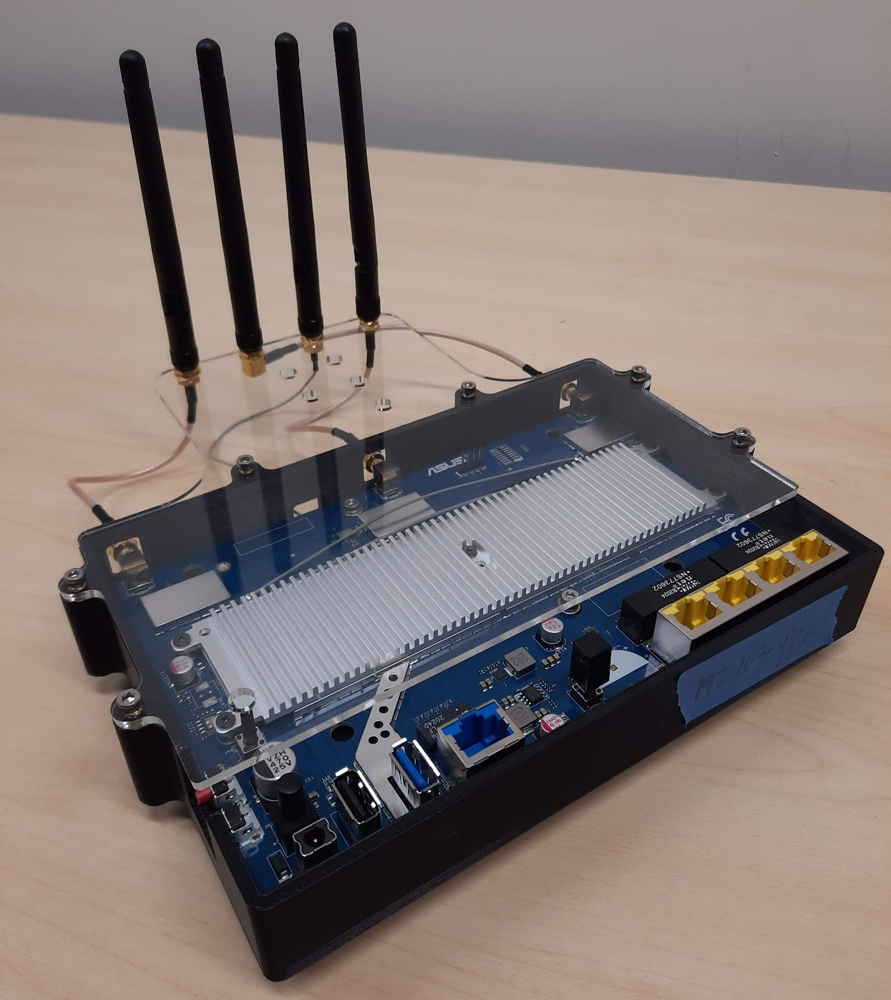

# WL-Local-Server Feature Branch: wifi_data_collection_phone

## Description

This branch is about setting up the Wi-Fi CSI collector without the need for ROS, rather utilizing a Python socket script as well as an MQTT publisher to send the Wi-Fi messages.

## Key Changes

This feature introduces the following changes:

- Implemented a timestamp that can be used by the data synchronizer in WL-Local-Server, improving data accuracy for data collection.
- Fixed an issue with the mqtt callback that was cuasing errors on the Raspberry Pi APs.

# Python Integration for Nexmon-CSI

This is a package for integrating the [nexmon-csi](https://github.com/seemoo-lab/nexmon_csi) platform for an [ASUS RT-AC86U AP](https://www.asus.com/us/networking-iot-servers/wifi-routers/asus-wifi-routers/rt-ac86u/) utilizing Python for CSI data extraction. It is currently tested utilizing Raspberry Pi OS (64-bit).

< Go back to the [index page](https://github.com/ucsdwcsng/WiROS)

## Motivation

This tool provides open-source capability for collecting and processing CSI data in an online, scalable manner. While CSI extraction is a well studied topic, the integration of this CSI data into a larger sensor framework presents a lot of systems challenges for researchers. We worked on removing the robotics community's sensor management tool, [ROS](https://www.ros.org/), which caused software issues on Raspberry Pi's utilizing Ubuntu 20.04.

<p align="center">  </p>
<p align="center"> RT_AC86u with array setup for signal Angle-of-Arrival sensing </p>

## Installation and Setup

The project consists of a core node which interacts with the ASUS router via ethernet, and some secondary nodes which provide additional functionality. You need a computer with an ethernet port to run the platform, and an RT-AC86u AP. If you want to measure AoA, you will need to move the antennas' positions to create a useful array. We suggest removing the plastic case from the AP using the two screws on the back and placing the antennas in a permanent housing like as shown above.

### Step 1: Setting up the Router

- We need to be able to log into the AP in order to configure it. Connect to it over ethernet.
- If you bought a refurbished AP you may need to factory reset it using the small "Reset" button on the back. Press and hold this button for 5-10 seconds and the AP will reboot.
- The default IP Address for the reset AP will always be **192.168.50.1**. When connecting the router to your Raspberry Pi, you will need to be on the same subnet as the router, in which the following command will be used to make this connection:

```
    sudo ifconfig eth0 192.168.50.100 netmask 255.255.255.0
```

- You can then connect to it at [router.asus.com](http://router.asus.com) over Ethernet. If you can't access the router, you probably need to configure your ethernet interface to use DHCP.

- In the setup menu for the AP:
  - Select "Advanced Settings."
  - Choose Operation Mode->Access Point(AP) mode->Manually Assign IP.
  - Enter the IP address you want the AP to have (e.g. 192.168.48.x) . Subnet mask can be 255.255.255.0 and the default gateway and DNS servers can be 0.0.0.0.
  - Tip: We recommend putting all of the APs on the same subnet. If you have a lot of APs in your experiment and don't want to keep track of which computer is connected to which AP, the node can be set to run nmap and automatically detect the IP of the AP it is connected to, assuming the subnet is known beforehand.
  - You can set the network name and password, but this network will not be operational once the Nexmon firmware is flashed.
  - Next, setup the login details for the AP. We recommend setting the same login and password for all the APs. This will be later needed to ssh into the AP.
  - Once you enter these options, the AP will restart.
- Next, we need to set up the ethernet setting on the laptop end. We suggest creating a new connection profile and giving yourself a static IP (e.g. 192.168.43.yyy). Remember to switch to this connection profile or you won't be able to connect to the AP. To do this on the Raspberry Pi, use the following command:

```
    sudo ifconfig eth0 192.168.48.100 netmask 255.255.255.0
```

- Open a browser and enter the AP's IP (192.168.48.x) in the search bar. If this connection fails, confirm if you can ping the AP, check the ethernet connection setting, or reboot the AP. For example:

```
    ping 192.168.48.1
```

- Login to the AP, and navigate to `Administration->System->Service`.
  - Set `Enable SSH` to `True` (Or `'LAN only'` on some versions).
  - Set timeout to zero.
  - Apply the settings and proceed to the next step.

### Step 2: Installing the Nexmon CSI firmware

- The AP has non-volatile storage mounted at /jffs/ which is where we will install the necessary scripts and binaries, located in nexmon_firmware/csi.

- Copy the needed scripts. The username/password are the same one used to log into the GUI:

```
scp -r ~/wifi_ws/src/wiros_csi_node/nexmon_firmware/csi USERNAME@ASUS_IP:/jffs/
```

- Mark them as executable:

```
sshpass -p PASSWORD ssh USERNAME@IP chmod +x /jffs/csi/*.sh
```

## Usage Instructions

On a high level, when you start `csi_node`, it will attempt to log into the AP and set it to monitor mode. Any packets the AP sees will then be sent over ethernet to the node, where they are read and sent to an MQTT publisher.

### Launch

To launch the Wi-Fi CSI collector, run the following commands after cloning the wiros_csi_node repo.

```
cd wiros_csi_node/src/pythonNoRos
python3 nexcsiserver.py
```

### JSON Config Parameters

**_login_**

- `host` : The host name of the AP.
- `host_ip` : The IP of the asus you want to connect to. If you specify a wildcard for the last byte (i.e. `192.168.43.*`) then the node will scan for the AP on that subnet using nmap.
- `asus_pwd` : The password to log in to the ASUS.

**_channel params_**

- `channel` : The channel to listen on. Should be set to a control channel. The ASUS can only see packets sent on this channel.
- `bw` : The bandwidth to listen to (20,40,or 80.) Most traffic in the wild is 20MHz. Listening on 40 or 80MHz, you may occasionally pick up 20MHz transmissions which will fill the corresponding subcarriers, the others will be noise. You should select 20MHz if you are listening on a 2.4GHz channel.

To familiarize yourself with which channels are valid to listen on, we recommend checking out [this list](<https://en.wikipedia.org/wiki/List_of_WLAN_channels#5_GHz_(802.11a/h/j/n/ac/ax)>), or the corresponding 2.4GHz section above.
For example, to listen on channel 155 (80MHz centered at 5.775 GHz), you would set bw to 80 and channel to either 149, 153, 157 or 141 (The control channels which expand to channel 155).

**_packet params_**

- `use_software_mac_filter` : Set to **true** if you are using a MAC filter for CSI Collection, and set to **false** if you are not using a MAC filter.
- `mac_filter` : Wi-Fi frames whose MAC addresses do not start with these bytes will be ignored.
  The list can be 0-6 bytes. The first two bytes are filtered for in hardware on the asus to reduce traffic between the bcm4366c0 wifi card and the asus's kernel. The other bytes are filtered in software on the node. For example, if you want to only listen to CSI from `12:34:56:78:9b`, you would set this as your MAC filter. If you wanted to listen to the devices `11:11:11:00:00:00` and `11:11:11:22:22:22`, you would set the filter to `"11:11:11:*:*:*"` **You will typically want to set your MAC filter to your Google Pixel's MAC Address**.
- `length` : Set to **6** if you are using a MAC filter for CSI Collection, and set to any value **<=2** if you are not using a MAC filter.
- `beacon_rate` : If nonzero, the asus will transmit a beacon packet every `beacon_rate` milliseconds. The packet's MAC address will be `11:11:11:a:b:x`, where a and b are the first two bytes of the computer running ROS's hostname, and x is the last byte of their ethernet IP.
- `beacon_tx_nss` : How many transmiter antennas to beacon with. Maximum of 3 for 2.4GHz channels and 4 for 5GHz channels.

**broadcast**

- `tcp_forward` : Forward the packets over TCP instead of directly bridging over ethernet. By default, the bcm4366c0 sends CSI data to the linux kernel running on the AP via udp broadcast packets. We forward these packets to the host PC using an ethernet bridge. However, we have seen that some systems are not able to see UDP broadcast packets. Setting `tcp_forward` will create a separate tcp connection between the AP and the ROS node, and the udp packets will be sent to the node from the AP via tcpdump->netcat. This is a little slower and requires more overhead processes on the router, so it is not used by default for systems that can see the udp broadcast.

### Using the Data

The `csi_node` publishes `WiFi` message data on the MQTT `/csi-ap{x}` topic. More information about the messages is [here](https://github.com/ucsdwcsng/rf_msgs).
This repo also contains functionality such as processing the CSI data in real time to give real-time angle of arrival, angle of departure, and calculation of calibration values.

## Direct packet injection

For debugging purposes or to inject arbitrary packets, you must SSH into the asus itself, configure it, and then run a script that calls `nexutil` to inject the packets.

```
ssh {...}

cd /jffs/csi
./reload.sh
./configcsi.sh {channel} {bandwidth} 4 #channel, bandwidth, number of rx-cores

./send.sh {bw} {nss} {packet period in usec} {MAC address in hex, separated by space} #or an equivalent script
```

see send.sh for examples. Essentially, you give the raw wifi frame in bytes(including frame ctl, sequence number, and everything,) and the asus will transmit the frame when it becomes available. Do not change the first four bytes injected as they inform nexutil about how to transmit the packet. The example packet in send.sh starts with the byte 0x88. You can modify send.sh however you want and copy the new files onto the asus to inject different packets.

## Citations

Reminder that if you use this software, you must cite nexmon:

@electronic{nexmon:project,
author = {Schulz, Matthias and Wegemer, Daniel and Hollick, Matthias},
title = {Nexmon: The C-based Firmware Patching Framework},
url = {https://nexmon.org},
year = {2017}
}

@inproceedings{10.1145/3349623.3355477,
author = {Gringoli, Francesco and Schulz, Matthias and Link, Jakob and Hollick, Matthias},
title = {Free Your CSI: A Channel State Information Extraction Platform For Modern Wi-Fi Chipsets},
year = {2019},
url = {https://doi.org/10.1145/3349623.3355477},
booktitle = {Proceedings of the 13th International Workshop on Wireless Network Testbeds, Experimental Evaluation & Characterization},
pages = {21–28},
series = {WiNTECH ’19}
}
